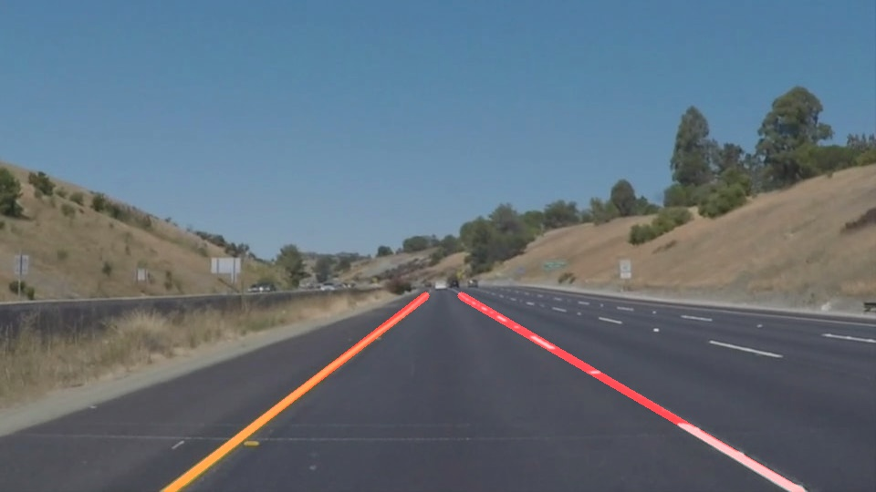

# **Finding Lane Lines on the Road**

---

**Finding Lane Lines on the Road**

The goals / steps of this project are the following:
* Make a pipeline that finds lane lines on the road
* Reflect on your work in a written report

[//]: # (Image References)

[image1]: ./examples/grayscale.jpg "Grayscale"

---

### Reflection

### 1. Describe your pipeline. As part of the description, explain how you modified the draw_lines() function.

My pipeline consisted of following steps:
1. convert the input image to grayscale
2. Apply Gausian blur to gray image
3. Find edges in blurred gray image using Canny edge detection
4. Get rid of unwanted edges using a polygon mask
5. Create a line image with lane lines only by drawing Hough lines on Canny edges
6. Lay line image over original image to create output image, i.e. image with lane lines drawn on top

In order to draw a single line on the left and right lanes, I modified the draw_lines() function with following modifications (These improvements were influenced with ideas from existing forum discussions and recommendations):
1. Seperate out right lanes from left lanes by looking at slope of the line
1. For each left and right lines:
	* find a polynomial fit line (degree 1) for all points using numpy's polyfit function
	* For minimum value of y co-ordinate of all points, draw the line using output coefficients from polyfit
	* To avoid jittery change in lane lines while processing video images, added a LineGenerator class to store previously computed coefficient values and number of points. This infomation is used to average out values of new coefficient values for current set of points.

Following is the sample output images of above pipeline:

### 2. Identify potential shortcomings with your current pipeline

While my implementation works well (mostly) for test images and videos, it horribly fails to detect lanes for challenge video. To my knowledge, following are the main factors which my implementation does not handle and needs to be improved in future:
1. Sunlight and shades are wastly creating noise in the image and confusing my pipeline implementation with false lane lines with high gradients
1. challenge video seem to have a constant curve for which straight lines are probably not the best choice

I guess upcoming sessions would have more info on how to deal with these problems, I am looking forward to them.

### 3. Suggest possible improvements to your pipeline

Following improvements are needed to improve my pipeline:
1. Some level of prior filtering of image for eliminating noise due to sunlight and shades on the surface
1. A better polynomial fit to fit for curved lanes
1. Better clustering to separate out lines on left lane vs lines on right lanes
